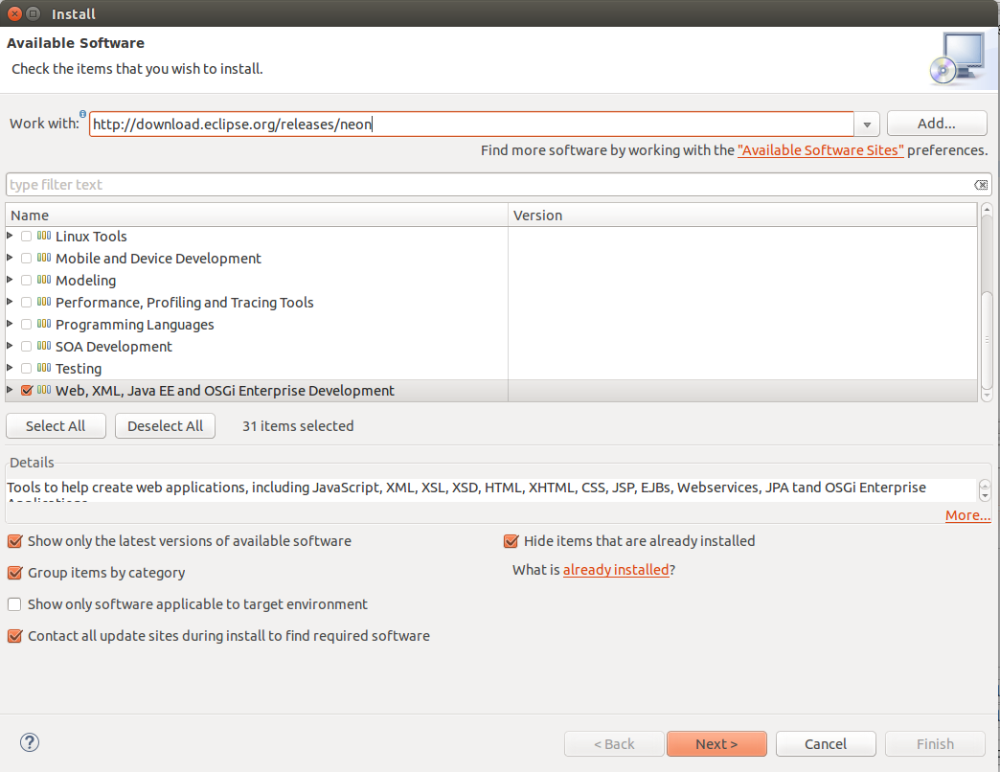
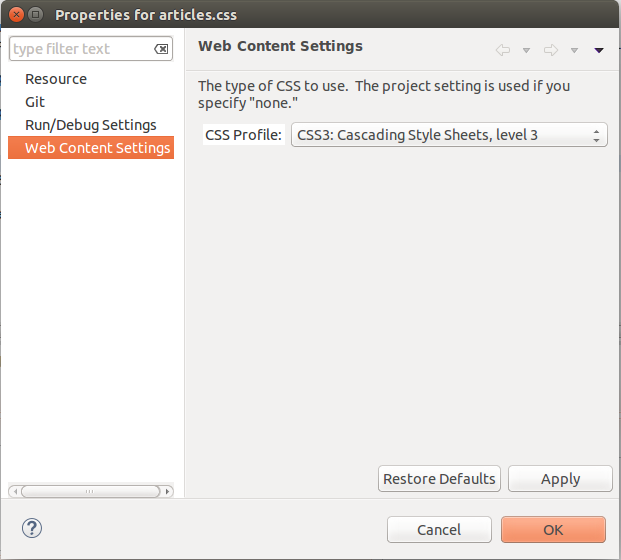

[[eclipse_editor]]
== CSS editor usage in Eclipse

Eclipse has an integrated CSS editor which by default supports CSS2. 
In order to see the new CSS3 properties you must activate this feature. 

You can activate it per file, Dynamic Web Project or Static Web Project, but not for other types of Projects.
It is also not available as a workspace-wide preference. 

First just make sure you have installed the Web Package of Eclipse. 
Otherwise you wont see the Web Content Settings in the Properties page.
In Eclipse go to Help -> Install New Software ... -> select your Eclipse release software site -> select the Web Package -> Press Next >

 

After the installation perform the following steps:

* Select a CSS file, Dynamic Web Project or Static Web Project and right-click on it
* Click on Properties
* Select the Web Content Settings
* Set the CSS Profile value to "CSS3: Cascading Style Sheets, level 3"
* Click the OK button

This guide applies for Eclipse releases up to Mars. With Neon M6 the default css profile will be set to CSS3.
