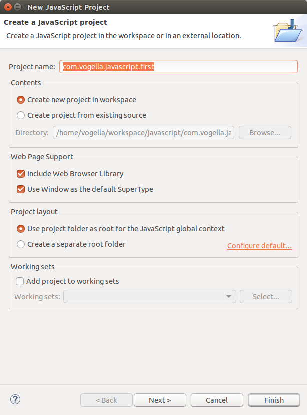
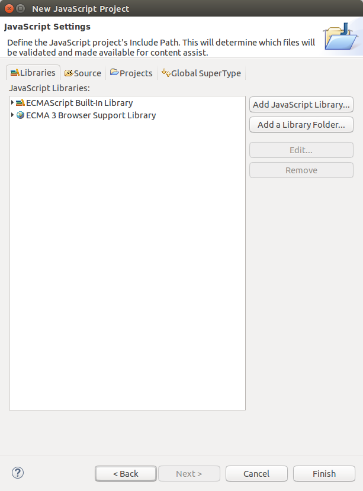
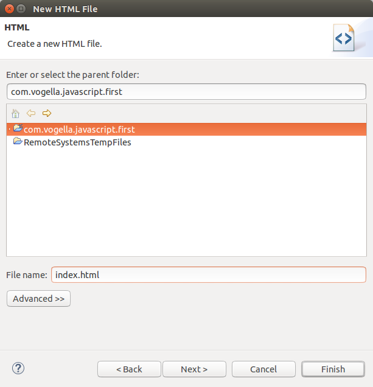
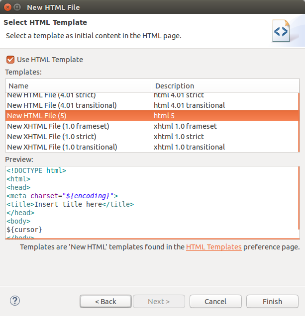
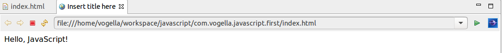
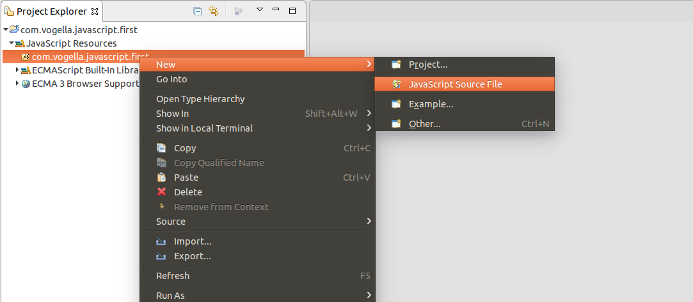

== What is JavaScript?

JavaScript is a scripting language which is primarily used within 
http://www.vogella.com/tutorials/HTML/article.html[HTML] webpages.
JavaScript is executed directly in the browser and all main browsers contain a compiler or interpreter for JavaScript. 
JavaScript is case sensitive. 
JavaScript and Java are completely different programming languages even though they have a similar name.

You can put JavaScript into an external file or directly into the HTML page. 
If you put the JavaScript code into the HTML page you can either put it into the header or in the body of the HTML page. 
JavaScript which is embedded into an HTML page must be surrounded by `` tags.
JavaScripts in the body is be executed while the page loads.
JavaScripts in the header is be executed when other JavaScript functions in the HTML body call them. 

[[eclipsejavascriptdownload]]
== Getting Eclipse IDE for JavaScript and Web Developers

Download the *Eclipse IDE for JavaScript and Web Developers* package from http://www.eclipse.org/downloads/index-developer.php.
Unzip is and start the Eclipse IDE and select a directory to work in.

[[firstjavascriptwitheclipse]]
== Your first JavaScript project with Eclipse

Select menu:View[File > New > JavaScript Project].

Create a new HTML file with menu:View[File > New > > Other > Web > HTML File].

 
Adjust the HTML code to the following. 
In this example the JavaScript is embedded into the HTML page. 

[source,html]
----
include::examples/javascript/helloworld.html[]
----

Afterwards open it via its context menu:Open View[Web Browser].
The commands within the script tags runs and "Hello, JavaScript!" is written to the webpage.

[[javascript_external]]

== Your first JavaScript outside an HTML page

You can also put the JavaScript in a separate file and include it into the HTML page. 
For example create the file 'javascriptinclude.html' with the following content.

[source,html]
----
include::examples/javascript/javascriptinclude.html[]
----

Create the file 'myfirstjsfile.js' in the same directory as the HTML page.
			

As the JavaScript is in a separate file you do not have to  use script tag. 
Simple write the code directly into the file.

[source,html]
----
include::examples/javascript/myfirstjsfile.js[]
----

Open the HTML page in a browser. 
The script should get executed and you should see the message.
