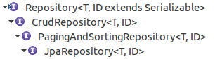

== Spring Data JPA

Spring Data JPA provides the possibility to omit all the boilerplate code, which has to be written for DAO classes for domain types (entities).
So rather than implementing data access methods, e.g., CRUD methods, for different domain types over and over again, only a repository interface has to be defined and the concrete implementation is generated at application startup automatically by Spring.

=== Common Spring Data JPA repository implementations

Provided interfaces for repositories are:

.Table Spring Data JPA repositories
[cols="45%, 55%"]
|===
|Type |Description

|`Repository<T, ID extends Serializable>`
|Marker interface for all Repository implementations

|`CrudRepository<T, ID extends Serializable>`
|Provides commonly used CRUD operations for a domain type <T>

|`PagingAndSortingRepository<T, ID extends Serializable>`
|Adds paging and sorting capabilities to the CrudRepository

|`JpaRepository<T, ID extends Serializable>`
|Adds possibility for batch processing of JPA calls.
|===

=== Custom Spring Data JPA repository query methods

Besides the given default repositories` methods, also custom methods can be specified in a custom repository interface.

Spring Data JPA is able to parse method names, tries to guess its purpose and tries to generate a proper implementation.

[source, java]
----
public interface TodoRepository extends CrudRepository<Todo, Long> {

	List<Todo> findBySummary(String summary);
}
----

The `findBySummary` method will find a list of todo objects by summary.

Interchangeable query verbs are:

* find
* get
* read

NOTE: So `getBySummary` or `readBySummary` would deliver the same query results as `findBySummary`.

TIP: Besides that another query verb is `count`, which returns the count of a query rather than the resulting objects.

Also the method's return type is interchangeable, so the actual query is also determined by the return type.

.Table Possible return types for query methods
[cols="1, 2"]
|===
|Type |Description

|Plain Type
|Returns the plain type or `null` in case nothing is found

|`Optional<T>` (Guava or Java 8)
|Returns an Optional<T> containing the actual object or an empty optional

|`List<T>`
|Returns a `List<T>` of found objects or an empty list in case nothing is found

|`Stream<T>`
|Returns a `Stream<T>` of found objects or an empty stream in case nothing is found
|===

Properties for a query can also be chained.

[source, java]
----
public interface TodoRepository extends JpaRepository<Todo, Long> {

	List<Todo> findBySummaryOrDescription(String summary, String description);
}
----

=== Using @Query for special SQL queries

The query DSL derived from method signatures is really powerful and easy to handle.
But if some query cannot be expressed by the method  signature the `org.springframework.data.jpa.repository.Query` annotation can be used.

[source, java]
----
public interface TodoRepository extends JpaRepository<Todo, Long> {

	@Query("Select t from Todo t where t.summary like 'a%'")
	List<Todo> findAllTodosWithSummariesBeginningWithA();
}
----

