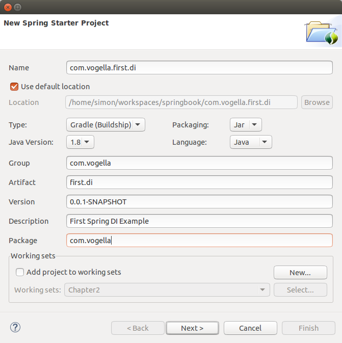
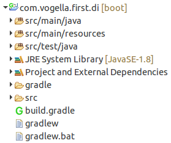

== Exercise - Spring DI Java Config

=== Target

In this exercise a minimal example about Dependency Injection with Spring is shown.

=== Create a Spring Project

Create a spring starter project, which can be found in the menu:New[Spring Starter Menu]

image::img/new-menu-spring-starter.png[] 

Use the following input for the Spring Boot wizard:

 

Just press btn:[Next] and btn:[Finish] in order to create a plain Spring Boot project.

The project will then look like this:

 

Add a new +ITodo.java+ interface, which should be available as bean in the Spring DI container.

[source, Java]
----
include::res/ITodo.java[]
----

The implementation of the `ITodo` interface should look like this:

[source, Java]
----
include::res/Todo.java[]
----

There are several ways to populate an`ITodo` implementation, but the easiest one is to use a Java configuration by using the `@Configuration` and `@ComponentScan` annotation.

Create a new _com.vogella.config_ package in the icon:folder-open[]src/main/java source folder.

Create a +Config.java+ class inside the _com.vogella.config_ package.

[source,java]
----
include::res/ConfigScan.java[]
----

This `Config` class let's spring automatically scan the whole _com.vogella_ package for classes, which should be available in Spring's DI container.

Change the +Application.java+ class to the following:

[source, Java]
----
include::res/Application.java[]
----

=== Validate

Run the `Application` class and see that an implementation of the `ITodo` interface is found and provided by the `AnnotationConfigApplicationContext`.

Besides the console output of the Spring framework this should be printed to the console:

[source, plain]
----
Todo [id=-1, summary=]
----
