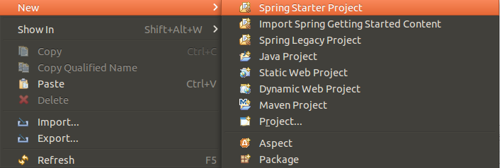
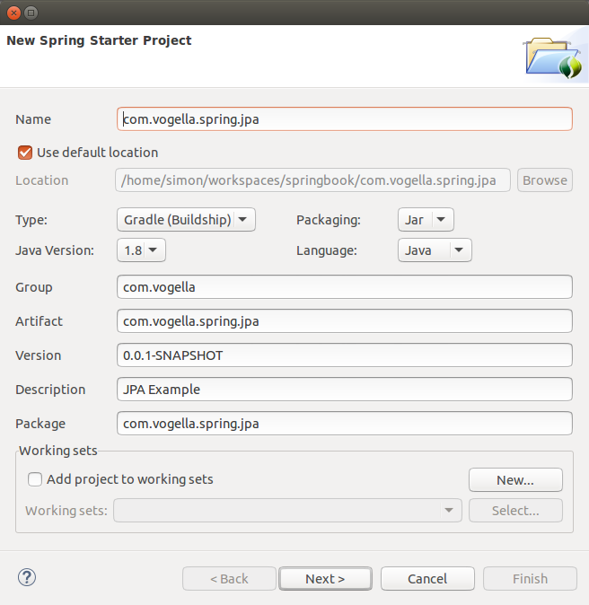
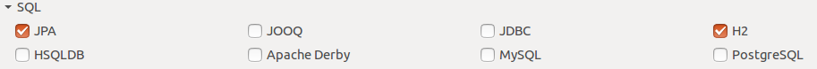
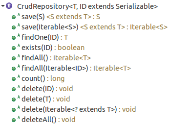

== Exercise - Spring Data JPA

=== Target

This exercise should show how to use Spring Data JPA with an H2 database.

=== Create a Spring Data JPA Project

Create a spring starter project, via the menu:New[Spring Starter] menu entry.

 

Use the following input for the wizard:

 

Now press btn:[Next] and choose _JPA_ and _H2_ in the _SQL_ category.

 

Then press btn:[Finish] in order to create a Spring Data JPA project.

=== Creating a JPA Entity

This time the `Todo` should be stored in a H2 database, therefore the `Todo` must make use of JPA annotations, like `@Entity`, `@Id` and `@GeneratedValue`.

[source, java]
----
include::res/jpa/Todo.java[]
----

=== Creating a DAO / Repository

When using Spring Data JPA it is not necessary to write all the boilerplate code, which usually has to be written to provide common CRUD functionality in a DAO.

For common CRUD functionality the `CrudRepository` interface has to be extended and everything else is provided automatically then.

[source, java]
----
include::res/jpa/TodoRepository.java[]
----

The `CrudRepository` interface contains several commonly used DAO methods, which will be available automatically for interacting with persisted `Todo` objects.

=== Validate

To work with the `TodoRepository` a `CommandLineRunner` can be used.

[source, java]
----
include::res/jpa/Application.java[]
----

Running the application should result in the following output.

[source, shell]
----
Todo [id=1, summary=Test, description=null]
Todo [id=2, summary=Detailed test, description=Detailed description]
----

=== Using the Spring Data JPA Query DSL

For repository interfaces it is possible to create query like method names, which are parsed by Spring.

See <<custom-spring-data-jpa-repository-query-methods>> for further information.

==== Exercises Spring Data JPA Query DSL

Please add methods for the following queries:

. Query Todos by summary
. Query just one optional Todo by summary and due date
. Query a stream of Todos by summary or description
. Count the amout of Todos in the database table
. Write a custom query for all todos in the year 2016
. Get all available Todos asynchronously 

==== Solutions for Spring Data JPA Query DSL exercises
