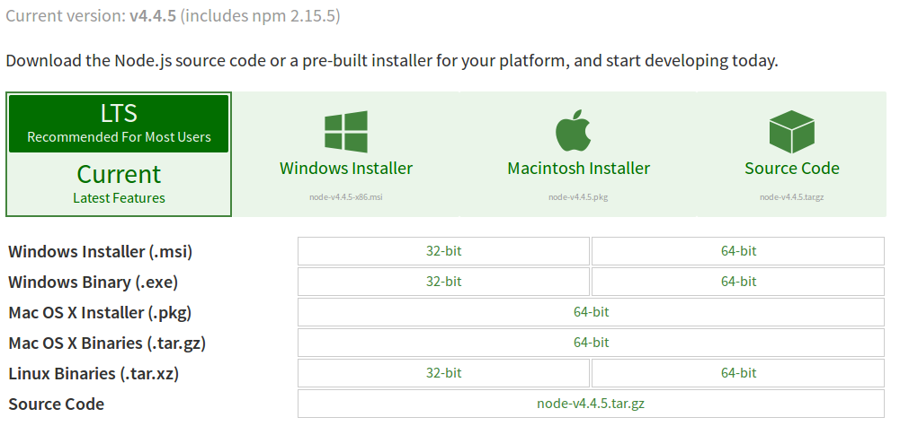
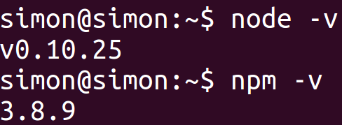
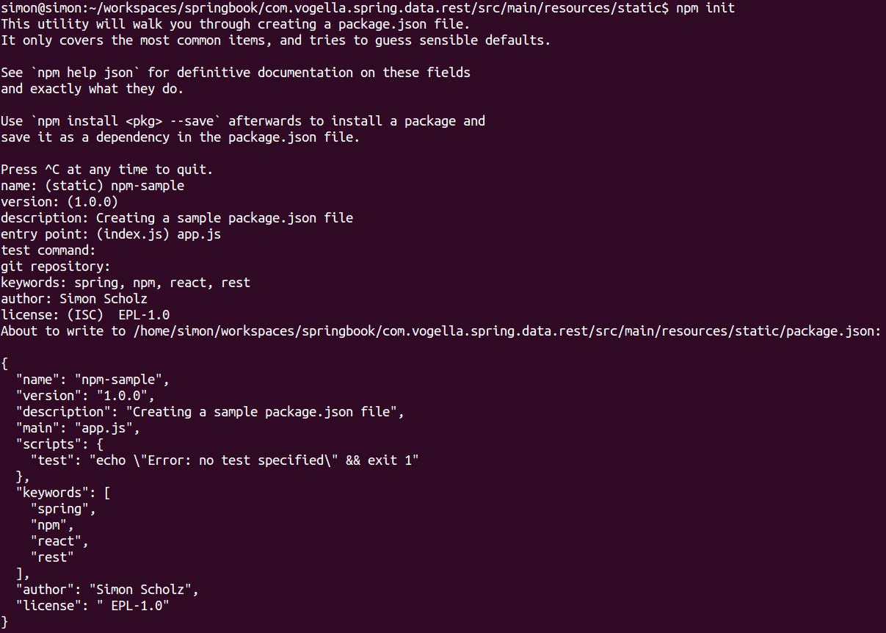
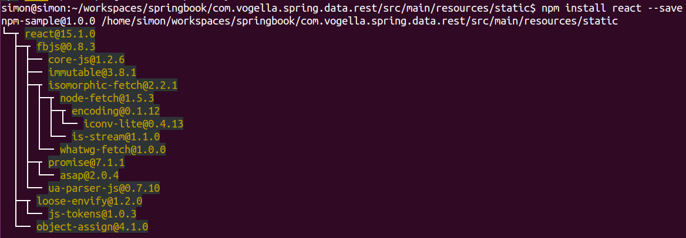

== Exercise - Install and use NPM

=== Target

NPM is a build tool to resolve JavaScript dependencies, which should be used in a web project.

=== Install NPM

NPM is shipped together with NodeJS, which can be downloaded here: https://nodejs.org/en/download/

On this the proper operating system can be chosen.

To check the installation type `npm -v` in the command line.

=== Generating a package.json file

A _package.json_ file is used to store the meta data of a JavaScript project.
It is pretty similar to a pom.xml or build.gradle file.

Having NPM properly installed it helps creating such a _package.json_ file.

Just go to the _/com.vogella.spring.data.rest/src/main/resources/static_ folder from previous exercises in the command line, type `npm init` and give proper input, for example what is shown below.

=== Adding dependencies to the project

Dependencies can be added by using the `npm install {your-desired-js-package}` command, e.g., `npm install react --save`.

TIP: `--save` adds the dependency to the `dependency` closure in the _package.json_ file.

TIP: `--save-dev` adds the dependency to the `devDependencies` closure in the _package.json_ file, which is used for dependencies during development.

The following packages should be added:

<1> react (use --save)
<2> react-dom (use --save)
<3> rest (use --save)
<4> babel-core (use --save-dev)
<5> babel-loader (use --save-dev)
<6> babel-preset-es2015 (use --save-dev)
<7> babel-preset-react (use --save-dev)
<8> webpack (use --save-dev)

After adding all these packages the contents of the _package.json_ file should look similar to this:

[source, json]
----
include::res/js/package.json[]
----

NOTE: The _node_modules_ folder, which is created besides the _package.json_ file should not be checked into version control. So it's likely added to a _.gitignore_ file.

